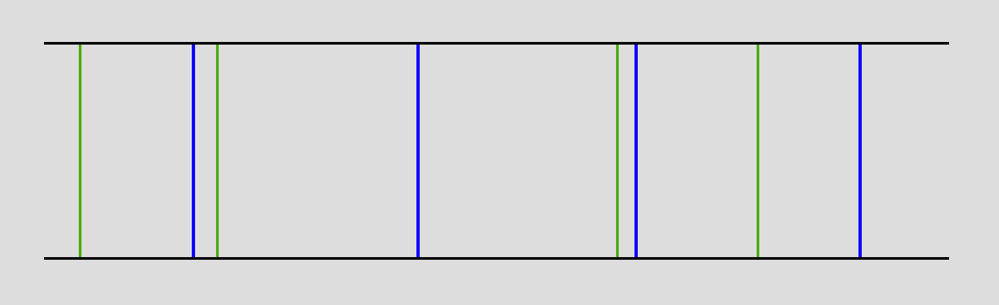
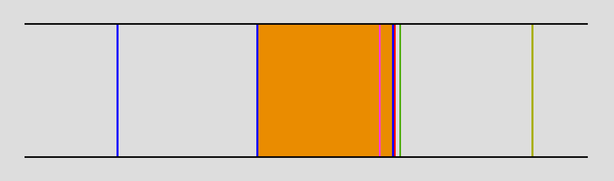
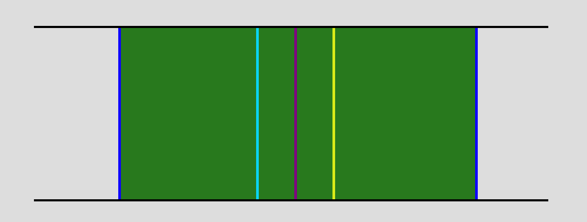

# 게임플레이

## 라인
Beatblocks는 총 8개의 라인을 사용하며, 채보에 따라 2~8개의 키를 선택하여 사용할 수 있습니다.
각 라인 개수 별 사용하는 키보드 자판의 종류는 아래와 같습니다.
<table>
  <tr>
    <th>키보드</th>
    <td align="center">1</td>
    <td align="center">2</td>
    <td align="center">3</td>
    <td align="center">4</td>
    <td align="center">6</td>
    <td align="center">7</td>
    <td align="center">8</td>
    <td align="center">9</td>
  </tr>
  <tr align="center">
    <th>라인</th>
    <td>8</td>
    <td>6 ~ 8</td>
    <td>4 ~ 8</td>
    <td>2 ~ 8</td>
    <td>2 ~ 8</td>
    <td>4 ~ 8</td>
    <td>6 ~ 8</td>
    <td>8</td>
  </tr>
</table>
이때 사용하는 키보드 자판은 숫자패드가 아닌, 핫바의 슬롯을 선택하는 숫자키여야 합니다.

## 판정
Beatblocks의 [판정](../src/main/java/net/spacedvoid/beatblocks/common/game/Judgement.java)은 4단계로 이루어져 있습니다.
판정은 위에서부터 아래의 순서대로 우선하며, 판정의 단위는 tick( = 50ms)입니다.
1. PERFECT **:** 노트의 타이밍과 같은 틱에 처리했을 경우
2. GREAT **:** 노트의 타이밍에서 ±1틱 내에 처리했을 경우
3. GOOD **:** 노트의 타이밍에서 ±2틱 내에 처리했을 경우. 이 판정은 콤보를 끊습니다.
   - 아래 판정들은 GOOD의 하위 분류이며, 결과창에서만 나타납니다.
    1. FAST **:** 노트의 타이밍에서 -2틱 내에 처리했을 경우
    2. SLOW **:** 노트의 타이밍에서 +2틱 내에 처리했을 경우
4. MISS **:** 노트의 타이밍에서 < -2틱 또는 > +2틱에서 처리했을 경우. 이 판정은 콤보를 끊습니다.

### 판정 조정
인게임에서 판정의 난이도를 조정할 수 있습니다.
1. 엄격한 판정 **:** PERFECT와 GOOD, MISS 판정만 존재합니다. GOOD 판정이 ±1틱 이내가 되며, 콤보를 끊습니다. (판정 범위 ±25ms)
2. 보통 판정 **:** 기본값 판정을 사용합니다. (판정 범위 ±75ms)
3. 느슨한 판정 **:** GOOD 판정이 콤보를 끊지 않습니다. (판정 범위 ±125ms)

판정 범위는 마인크래프트의 틱 시스템상 위와 달라질 수 있습니다.

---
### 애매한 판정에 대해

마인크래프트는 처리 주기가 20Hz입니다. 즉, 매 입력은 50ms마다 일괄적으로 처리된다는 것입니다.
(이 때문에 같은 틱 내에 두 개 이상의 입력을 필요로 하는 겨우 Beatblocks가 채보 파일을 변환할 때 오류를 표시합니다.)
따라서 밀리초 단위로 입력을 처리할 수 있는 다른 리듬게임과는 달리, 판정의 계산 방식이 특이합니다.

아래와 같은 "타임라인"이 있다고 해보겠습니다.

파란 선은 50ms미다 판정이 처리되기 시작하는 시간대입니다.

빨간 선은 (실제 타이밍과는 상관없이) 노트를 처리하기 위한 입력이 들어온 시간입니다.
판정은 파란 선 직후에만 처리되기 때문에 Beatblocks가 보는 입력은 아래의 초록 선과 같습니다:

이 때문에, 실제 입력과는 짧게는 1ms부터, 길게는 50ms까지의 오차가 생길 수 있습니다. Beatblocks는 이 오차를 무시합니다.
즉, 판정이 실제로 빨간 선에 입력되었음에도 Beatblocks는 초록 선에서 입력이 있었다고 가정합니다.
(다만, 초록 선의 다음 파란 선이 아닌 직전의 파란 선에서 판정이 처리되기 시작합니다.)

다만, 아래와 같은 상황을 가정할 수 있습니다.

이 그림에서 자주색 선은 실제 타이밍, 분홍색 영역은 이 노트가 PERFECT로 처리되기 위해 실제로 입력이 있었어야 하는 시간대입니다.
실제 입력(빨간색 선)은 실제 타이밍 직후에 들어와 보기에는 PERFECT 판정으로 처리되어야 한다고 생각됩니다.
하지만, 분홍색 영역 안에서 들어오는 입력은 주황색 선에서, 실제 입력은 초록색 선에서 처리되기 때문에 이 판정은 GREAT로 처리됩니다.
이와 같은 문제를 해결하기 위해 "애매한 판정" 시스템이 있습니다.

"애매한 판정"이 적용되기 위한 조건은 간단합니다.
실제 판정이 각 파란 선마다 파란 선 직후 10ms 이내이거나 40ms부터 다음 파란 선 사이일 경우 "애매한 판정"이 적용됩니다.

따라서, 위 그림에서 두 분홍색 영역에 "애매한 판정"이 적용되어 분홍색 영역의 모든 입력이 PERFECT로 처리되기 위해서는 특정 처리 주기(자주색 선)에서 -10ms(하늘색 선)부터 +10ms(노란색 선) 사이에 실제 판정이 존재하면 됩니다.

[BIC 채보 파일](./Charts.md)을 보면 애매한 판정의 적용 여부가 그저 `true` 또는 `false`로 정해져 있습니다.
이는 유저가 작성한 채보를 BIC 채보로 변환할 때 각 노트에 애매한 판정을 적용할지 결정한다는 것이므로, 실제 플레이타임에 이를 일일이 계산하지는 않습니다.